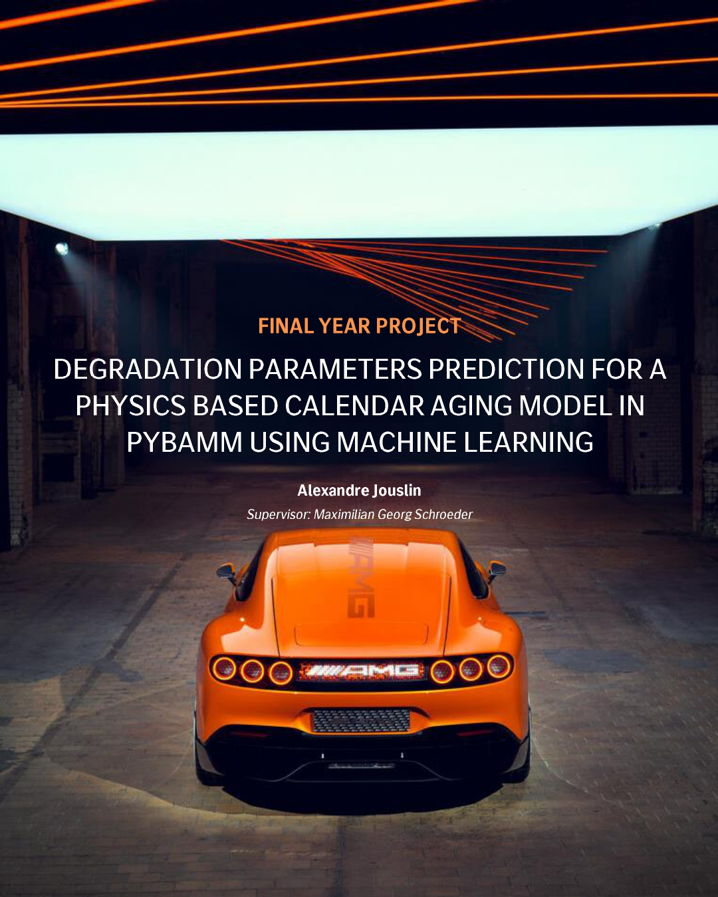
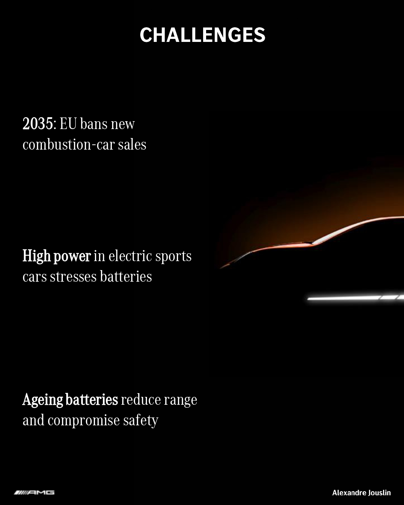
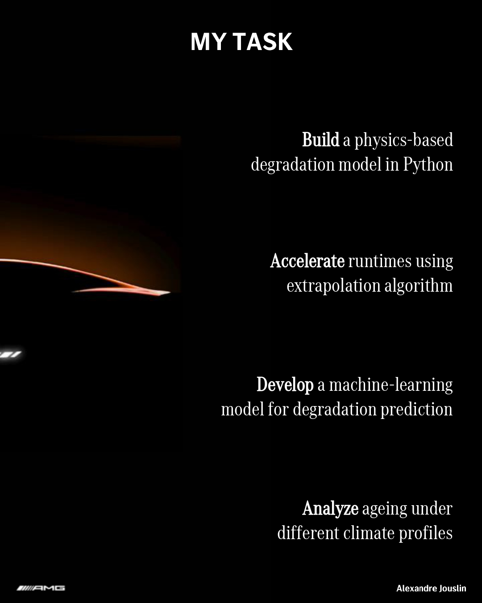
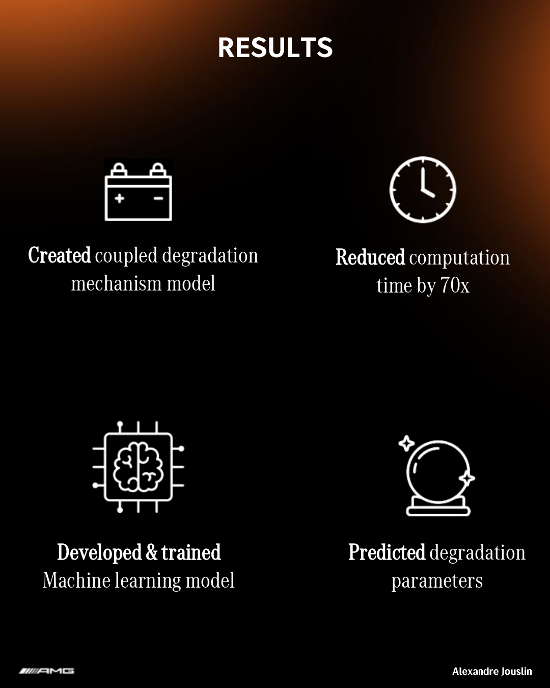

# Prediction of Degradation Parameters for a Physics-Based Calendar Aging Model in PyBaMM using Machine Learning

**Master Thesis** Alexandre Jouslin  
**Supervisor**: Maximilian Georg Schroeder

## Project
Development of a physics-based calendar aging model in PyBaMM, accelerated by an inter-cycle extrapolation algorithm, and enhanced with a Machine Learning model to predict degradation parameters.

## Industry Challenges

## Task

## Results

## 🛠️ Technologies Used
- **PyBaMM** – Physics-based battery modeling
- **Scikit-learn** – Machine Learning

---

**Project carried out at Mercedes-AMG in Affalterbach, Germany**  
Project defended on September 3, 2025 at Chimie ParisTech

---

**Feel free to reach out** if you want to discuss this project or explore potential collaborations

**Alexandre Jouslin**  
Engineer | Chemistry • Machine Learning • Powertrain 
